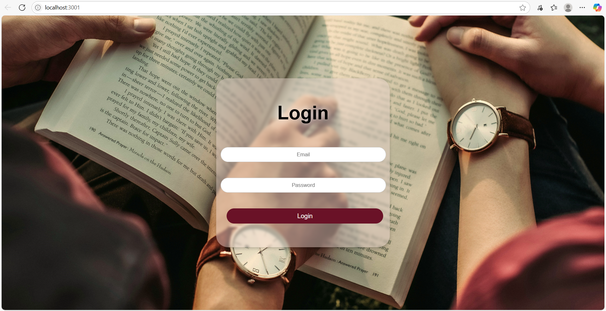
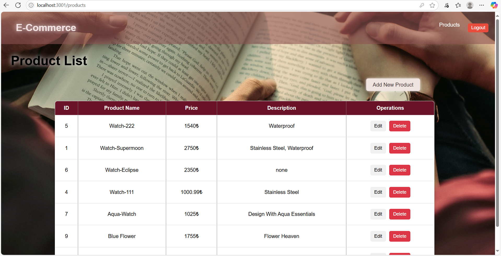
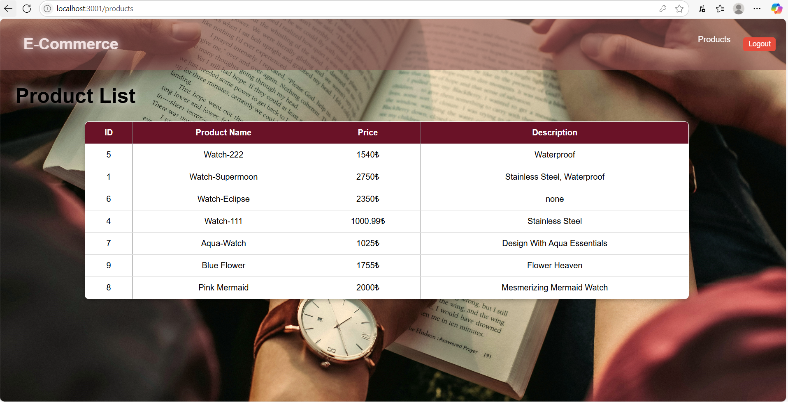

<<<<<<< HEAD
# 🛒 E-Commerce Product Management System

A full-stack product management system built with **NestJS** for the backend and **React** for the frontend.

## 🔐 Features

- User authentication with **JWT**
- Role-based access control (**admin** and **user** roles)
- Product CRUD operations
- Admins can add/edit/delete products
- Regular users can only view the product list
- Responsive and modern UI with vanilla CSS
- Protected routes based on authentication
- PostgreSQL database with **TypeORM**

## 🚀 Tech Stack

- Backend: **NestJS**, **TypeORM**, **PostgreSQL**
- Frontend: **React**, **Axios**
- Auth: **JWT (Bearer Token)**
- Styling: **Vanilla CSS**

## 🖥️ Screenshots

### Login Page



### Admin - Product Dashboard



### User - Read Only View



## ⚙️ Setup Instructions

### 1. Clone the repository

```bash
git clone https://github.com/Azime-SIMSEK/E-Commerce-Product-Management.git
cd E-Commerce-Product-Management
```

You need the following technologies to run this project:
- [Node.js](https://nodejs.org/) (v16+ önerilir)
- [PostgreSQL](https://www.postgresql.org/)
- [Git](https://git-scm.com/)


### 2. Backend Installation (NestJS)

```bash
 cd e-commerce
 npm install
 npm run start
```
#### 3. Environment Variables (.env file)
```env
 DB_HOST=localhost
 DB_PORT=5432
 DB_USERNAME=postgres
 DB_PASSWORD=yourpassword
 DB_NAME=ecommerce
 JWT_SECRET=supersecretkey
```

#### 4. Run the database
```bash
 npm run start:dev
```

### 5. Frontend Installation (React)
```bash
 cd frontend
 npm install
 npm start
```

---

## 🔑 Default Users
|  **Role	 |   Email	              |  Password** |
|------------|------------------------|-------------|
| **Admin**	 |   admin@example.com	  | admin123    |
| **User**	 |   test@123.com	      |  456789     |

🔒 Admin has full access.
👥 User can only view products.

---

## 🎯 Developer Notes
If you don’t configure the information in your .env file correctly, you won’t be able to connect to the database.

---

## 🧪 Testing
To manually test:

Login with one of the accounts above

Try to access product creation/editing/deleting as a regular user (it will be blocked)

Try as admin (it will succeed)

---

